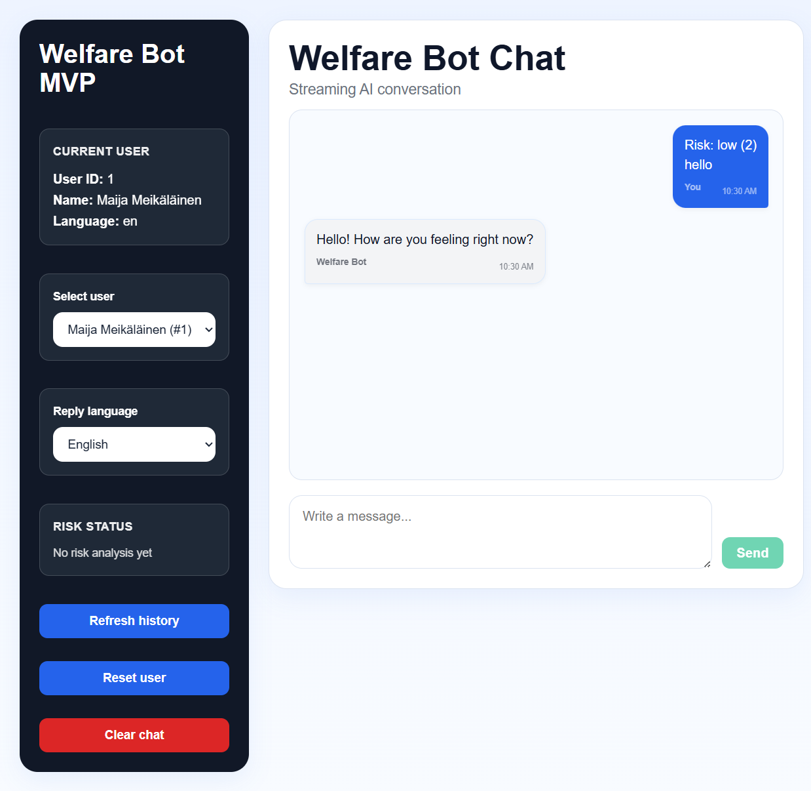
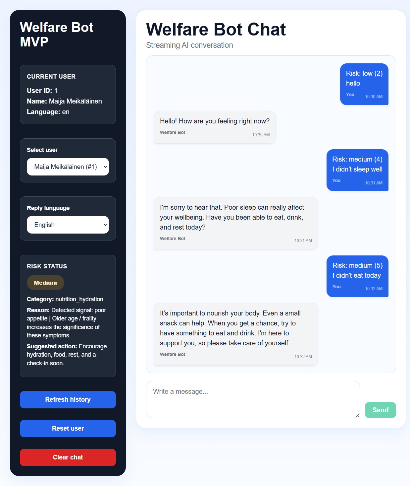
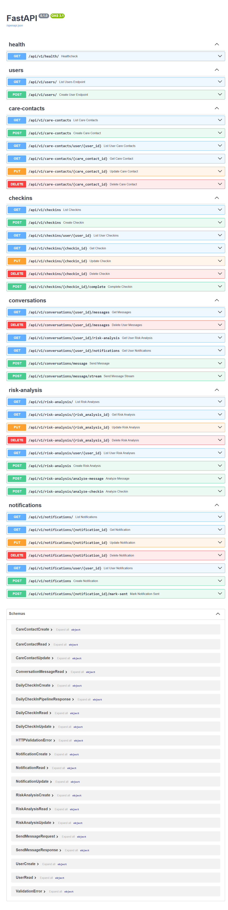
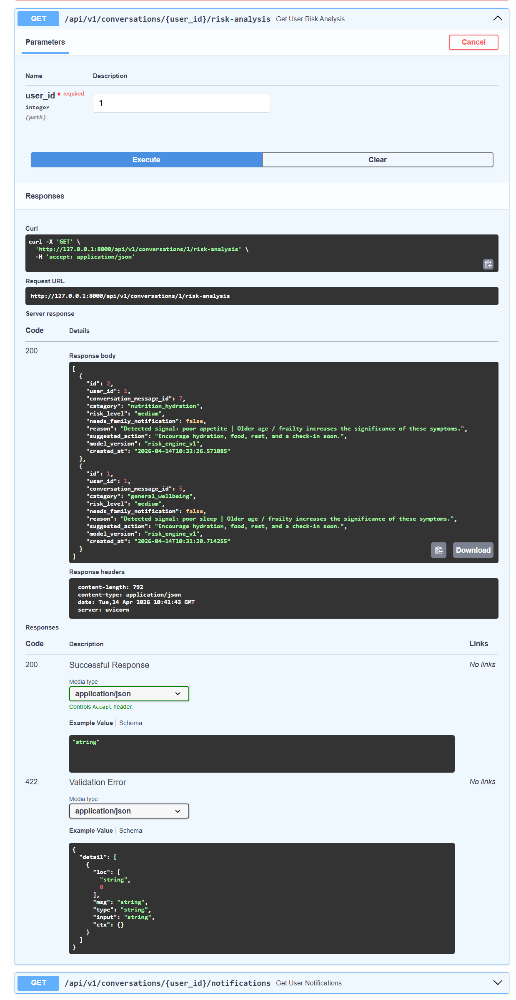

# Welfare Bot — Risk-Aware AI Chat with Data-Driven Analysis

A full-stack application that simulates a welfare assistant for elderly users.  
The system combines conversational AI with a structured risk analysis pipeline to detect potential health and wellbeing issues in real time.

---

## Overview

Welfare Bot is designed as a data-aware system where each user interaction is not only processed by an LLM, but also analyzed, scored, and stored for further evaluation.

The project demonstrates how AI can be combined with structured data processing to build safer and more reliable applications.

---

## Key Features

- Real-time AI chat with streaming responses
- Multilingual support (English, Finnish, Swedish)
- Data-driven risk analysis pipeline
- Risk classification: low / medium / high / critical
- Signal detection from user messages (sleep, nutrition, emotional state, etc.)
- Historical context awareness (recent messages influence risk score)
- Persistent storage of conversations and risk events
- API-first backend with structured endpoints

---

## Data & Risk Analysis Pipeline

The system processes each message through a structured pipeline:

1. User message is stored in the database
2. Signals are extracted using pattern-based detection
3. Risk score is calculated using weighted rules
4. Historical context is applied (recent messages)
5. Risk level and category are determined
6. Risk event is stored for further analysis
7. AI response is generated using risk-aware context

### Example

Input:
> "I didn’t sleep well and feel lonely"

Detected signals:
- poor_sleep
- sadness_loneliness

Result:
- Increased score due to multiple signals
- Risk level escalated (e.g. medium → high)
- Context-aware AI response generated

---

## Tech Stack

Frontend
- React + TypeScript (Vite)
- Streaming UI for real-time responses

Backend
- FastAPI
- OpenAI API (LLM integration)
- Custom risk analysis service

Data Layer
- PostgreSQL (Docker)
- SQLAlchemy ORM
- Alembic (migrations)

---

## Data Model (Simplified)

- User
- ConversationMessage
- RiskEvent
- Notification

The system separates:
- raw user input (messages)
- processed analytical output (risk events)

This enables further extensions such as:
- analytics dashboards
- trend detection
- predictive modeling

---

## Screenshots

### Chat Interface


### Risk-aware Response


### API Documentation


### Risk Analysis Endpoint


---

## API Example

Endpoint:

GET /api/v1/conversations/{user_id}/risk-analysis


Response example:
```json
{
  "risk_level": "high",
  "category": "emotional",
  "reason": "Detected signals: fatigue, loneliness",
  "suggested_action": "Encourage immediate check-in",
  "created_at": "2026-04-13T12:30:00"
}


Setup
1. Clone repository
git clone https://github.com/TanjaMel/welfare_bot.git
cd welfare-bot

2. Backend
cd welfare-bot-backend
python -m venv .venv
.\.venv\Scripts\activate
pip install -r requirements.txt

3. Database (Docker)
docker-compose up -d

4. Run backend
python -m uvicorn app.main:app --reload

API docs:

http://127.0.0.1:8000/docs

5. Frontend
cd ../frontend
npm install
npm run dev

Frontend:

http://localhost:5173


## What This Project Demonstrates

Full-stack development (frontend + backend + database)
Designing API-driven systems
Combining AI with deterministic data pipelines
Building explainable risk scoring logic
Working with structured and unstructured data together
Implementing real-time streaming interfaces

## Future Improvements

Replace rule-based risk engine with ML model
Add analytics dashboard 
Time-series analysis of user wellbeing
Notification system (SMS / email integration)
User segmentation and personalization