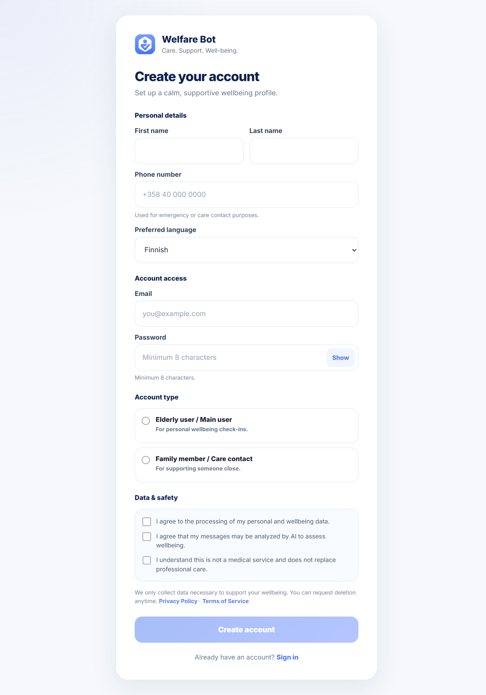
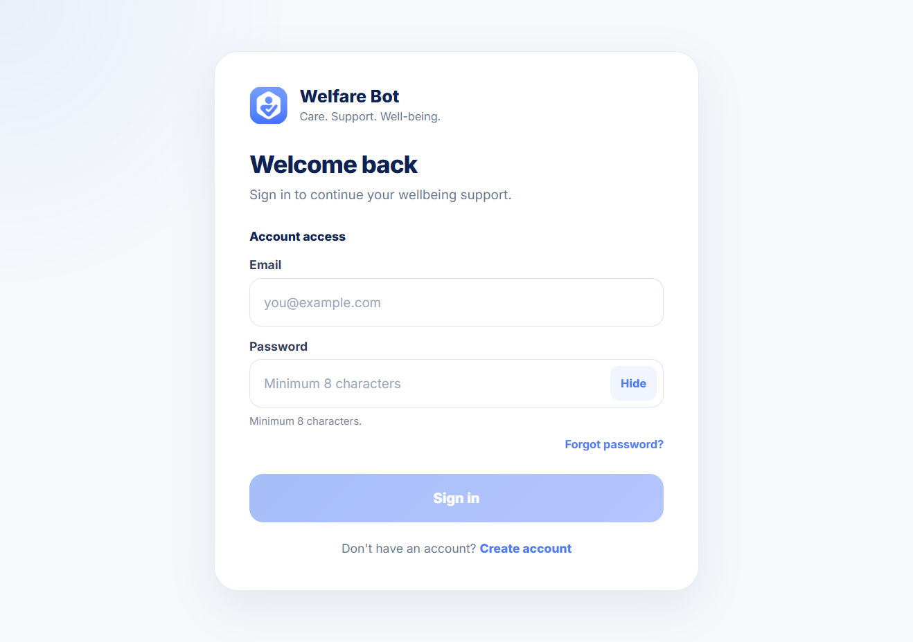
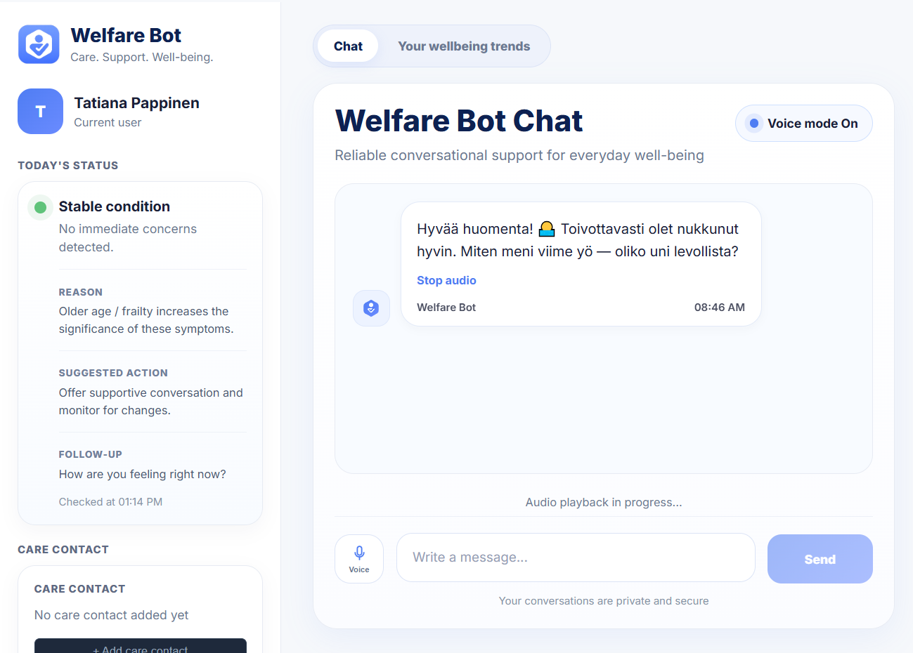
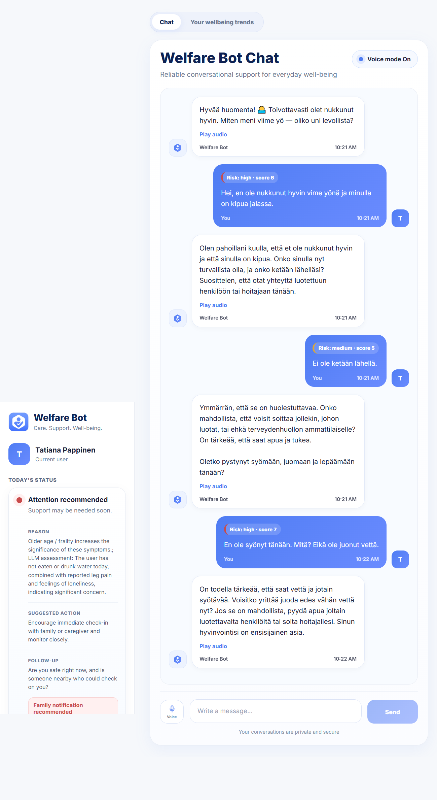
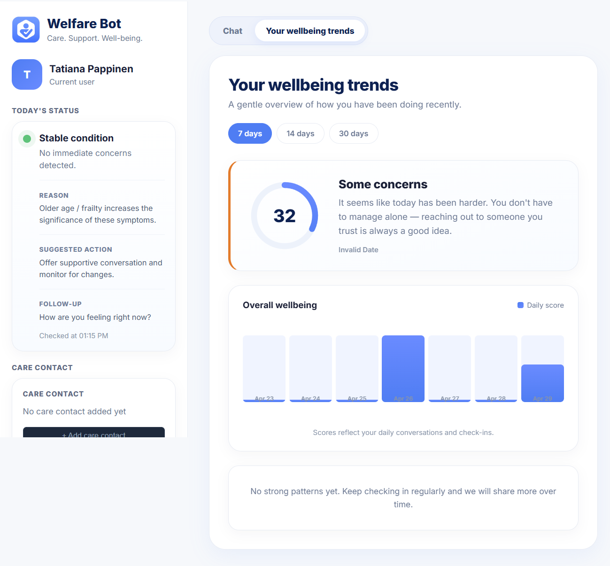
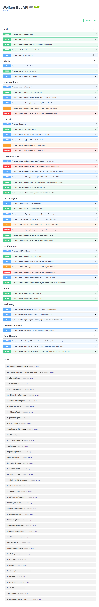
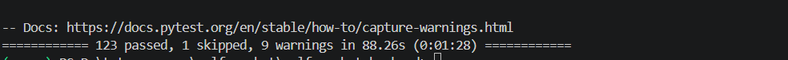

Welfare Bot

AI-powered full-stack system for proactive elderly wellbeing monitoring

Welfare Bot is a production-style full-stack application that combines conversational AI, backend data pipelines, and machine learning to detect early signs of decline in elderly users living independently.

The system is designed as a scalable architecture — not just a chatbot — with clear separation between API, services, ML layer, and frontend.

Live Demo

https://welfarebot-production.up.railway.app

## Screenshots

### Registration

---

### Login

---

### Finnish conversation — daily check-in
The bot greets the user in Finnish and asks about their night.

---

### Risk detection in action
User mentions pain and poor sleep — bot detects signals and responds with concern.

---

### Wellbeing trends
7-day trend chart with daily scores and soft insights.

---

### API documentation
Full REST API with 30+ endpoints.

---

### Test suite — 123 passing

Architecture (Fullstack Focus)
Frontend (React + TypeScript)
        ↓
API Layer (FastAPI)
        ↓
Service Layer (Business Logic)
        ↓
Data Layer (PostgreSQL)
        ↓
ML Layer (scikit-learn + AI models)
Key architectural decisions
Layered backend architecture (API → services → DB)
Stateless API with JWT authentication
Background processing via scheduler (APScheduler)
Separate ML pipeline (not blocking API requests)
Frontend fully decoupled via REST API
Core Components
Backend (FastAPI)
REST API with modular endpoints:
auth
conversations
wellbeing
anomaly detection
admin dashboard
SQLAlchemy ORM + Alembic migrations
JWT authentication
Service Layer

Encapsulated business logic:

risk_service — hybrid rule + LLM risk detection
aggregation_pipeline — daily wellbeing scoring
anomaly_detector — statistical detection
ml_anomaly_model — IsolationForest model
data_quality — validation & monitoring
Data Layer

Main entities:

users
conversation_messages
daily_checkins
risk_analyses
wellbeing_daily_metrics
care_contacts

Supports time-series analytics and personalization.

ML Layer
IsolationForest (per-user anomaly detection)
Feature engineering (10 features)
StandardScaler preprocessing
Hyperparameter tuning
Evaluation metrics (precision / recall / F1)

Additional:

Z-score anomaly detection
Trend slope analysis
Frontend (React + TypeScript)
SPA built with Vite
Component-based architecture
API-driven state

Features:

Chat interface
Wellbeing analytics
Auth system
Admin dashboard
Key Features
Conversational AI check-ins
Risk detection (rule-based + LLM)
Wellbeing scoring system
ML anomaly detection
Data quality monitoring
Admin dashboard
Care contact system
Tech Stack

Backend

FastAPI
PostgreSQL
SQLAlchemy
Alembic
APScheduler

AI / ML

OpenAI (GPT-4o-mini, Whisper, TTS)
scikit-learn (IsolationForest)

Frontend

React
TypeScript
Vite

DevOps

Docker
Railway
Testing
120+ automated tests
Covers:
ML models
pipelines
API
scheduler
pytest app/tests/
What this project demonstrates
Full-stack system design
Production-style backend architecture
Real ML integration
Data pipeline thinking
Scalable application structure