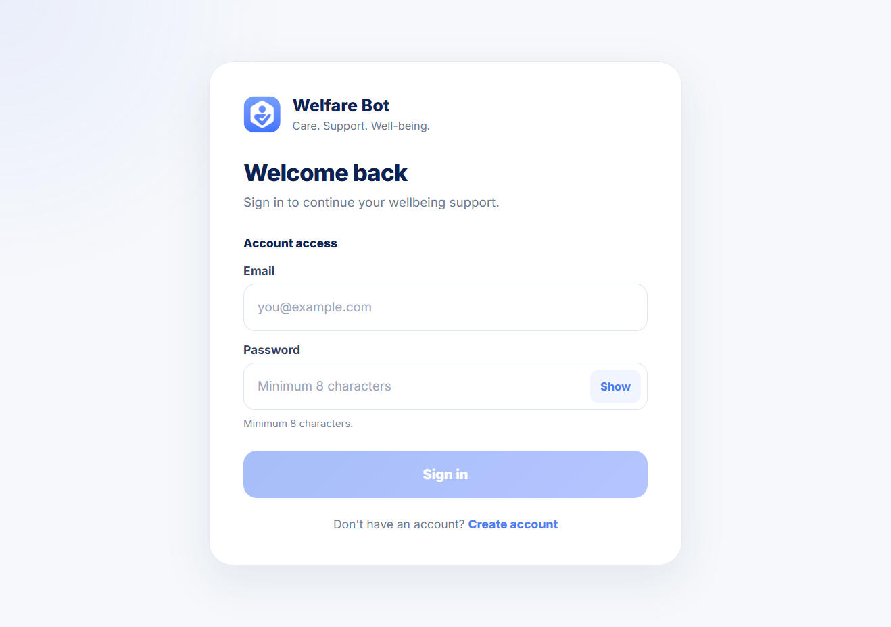
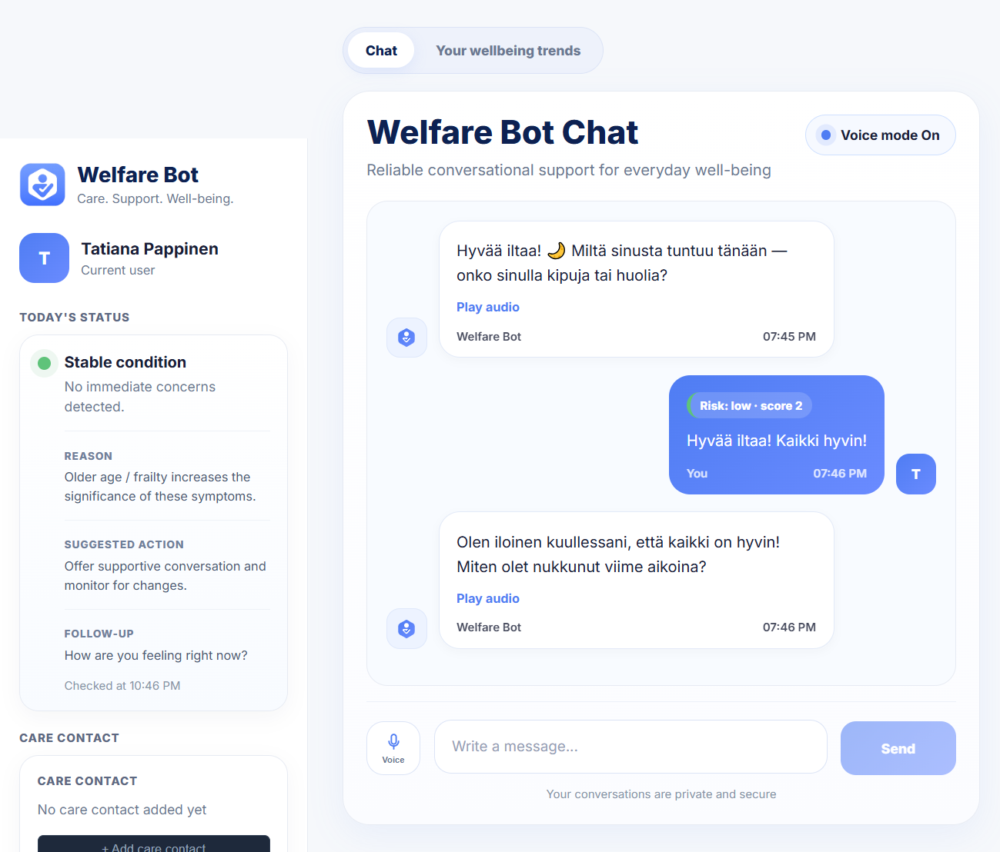
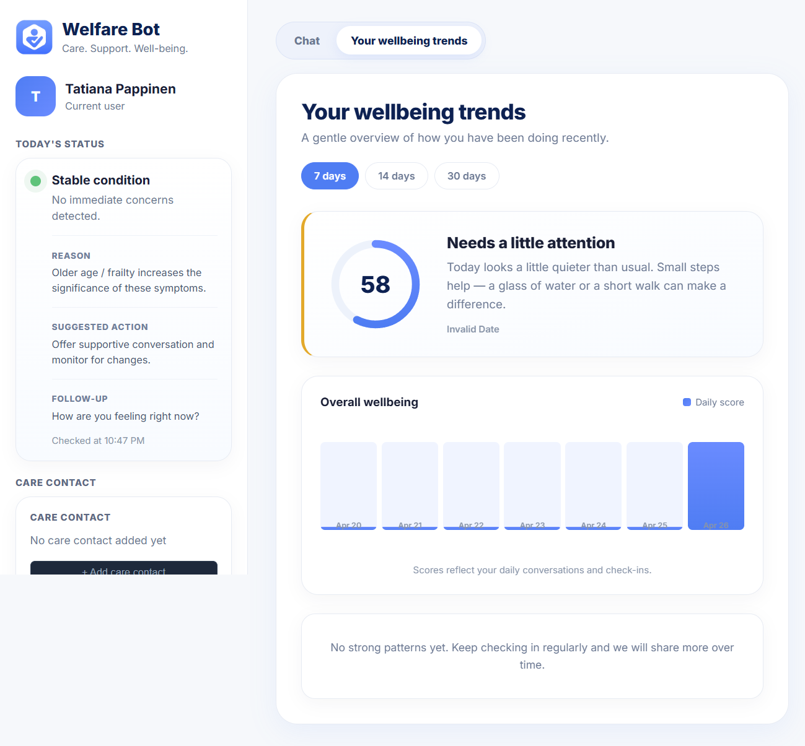

# Welfare Bot

**AI-powered wellbeing assistant for elderly people living independently**

Welfare Bot is a conversational AI system that proactively checks in with elderly users, detects early signs of risk through natural language, and alerts care contacts when intervention may be needed.

The goal is simple: detect problems early — before they become emergencies.

---

## Live Demo

https://welfarebot-production.up.railway.app

---
## Screenshots

### Registration


---

### Login



---

### Chat
Core interaction: natural conversation with risk-aware responses.



### Wellbeing trends



---

## The Problem

Elderly people living alone face a significant risk of silent deterioration:

* missed meals and dehydration
* poor sleep and fatigue
* loneliness and emotional decline
* falls or medical symptoms that go unnoticed

In Finland, a large number of elderly individuals live independently without continuous supervision.

Existing solutions are limited:

* they require active user action (panic buttons)
* family members cannot monitor continuously
* scheduled care calls are infrequent and rigid

As a result, many issues are detected too late.

---

## The Solution

Welfare Bot introduces a proactive AI assistant that:

* initiates conversations automatically
* understands natural language input
* detects risk signals in real time
* adapts communication style based on severity
* alerts care contacts when necessary

All of this works without requiring new hardware or technical skills from the user.

---

## Core Features

### Conversational Check-ins

* Daily interaction (morning, afternoon, evening)
* Natural, human-like dialogue
* Multilingual support (Finnish, English, Swedish)

---

### Risk Detection Engine

The system analyzes user messages and detects signals related to:

* sleep quality
* food and hydration
* physical pain or illness
* emotional state
* falls and acute symptoms

Risk levels:

* Low
* Medium
* High
* Critical

The assistant adapts its tone accordingly:

* low risk → conversational
* high risk → direct and safety-focused
* critical risk → immediate action guidance

---

### Wellbeing Analytics

* Daily aggregated wellbeing score

* Based on:

  * mood
  * sleep
  * food
  * hydration
  * medication
  * social activity

* Trend visualization for:

  * 7 / 14 / 30 days

Results are presented as human-readable insights rather than raw numerical data.

---

### Care Contact System

* Store contact details for family or caregivers
* Define notification preferences
* System flags when contact should be alerted

---

### Voice Interface

* Speech-to-text using Whisper
* Text-to-speech responses
* Designed for accessibility and ease of use

---

## Demo Flow

1. Register a new user
2. Start a conversation
3. Send a message (e.g. "I haven't eaten today")
4. Observe risk detection
5. Check the wellbeing panel

---

## Architecture

```
User (Browser)
        │
        ▼
React Frontend (Vite)
        │
        ▼
FastAPI Backend
        │
 ┌──────┴────────┐
 ▼               ▼
PostgreSQL     OpenAI API
               (GPT / Whisper / TTS)
```

---

## Tech Stack

### Backend

* Python 3.11
* FastAPI
* PostgreSQL
* SQLAlchemy ORM
* Alembic migrations
* JWT authentication (PyJWT + bcrypt)

### AI

* GPT-4o-mini (conversation)
* Whisper (speech-to-text)
* Text-to-speech (OpenAI TTS)

### Frontend

* React 18
* TypeScript
* Vite
* Custom CSS (no UI framework)

### DevOps

* Docker (multi-stage build)
* Railway deployment

---

## Project Structure

```
welfare-bot/
├── Dockerfile
├── welfare-bot-backend/
│   ├── app/
│   │   ├── api/
│   │   ├── services/
│   │   ├── db/models/
│   │   └── integrations/
└── frontend/
    └── src/
        ├── components/
        ├── api.ts
        └── App.tsx
```

---

## Risk Engine Design

The system uses a hybrid approach:

### Rule-based engine

* deterministic
* fast
* explainable

### LLM-based layer

* natural conversation
* contextual understanding

This separation ensures both reliability and flexibility.

---

## Wellbeing Scoring Model

| Component       | Weight |
| --------------- | ------ |
| Mood            | 25%    |
| Sleep           | 25%    |
| Food            | 20%    |
| Hydration       | 15%    |
| Medication      | 10%    |
| Social activity | 5%     |

The final score combines structured check-in data and detected risk signals.

---

## Security and Ethics

* Explicit user consent is required during registration
* Sensitive data is handled carefully
* AI provides support, not medical diagnosis
* The system avoids making clinical decisions

---

## Local Development

### Start database

```bash
docker-compose up -d
```

### Backend

```bash
cd welfare-bot-backend
pip install -r requirements.txt
alembic upgrade head
uvicorn app.main:app --reload
```

### Frontend

```bash
cd frontend
npm install
npm run dev
```

---

## Deployment

* Single Docker container (frontend + backend)
* Hosted on Railway
* Automatic deployment from GitHub

---

## Environment Variables

| Variable       | Description                  |
| -------------- | ---------------------------- |
| DATABASE_URL   | PostgreSQL connection string |
| OPENAI_API_KEY | OpenAI API key               |
| SECRET_KEY     | JWT signing secret           |

---

## Roadmap

* Email and SMS alerts
* Admin dashboard for care workers
* Conversation memory between sessions
* Medication reminders
* Email verification
* Password reset

---

## Target Users

### Elderly users

* daily support through conversation
* simple and accessible interaction

### Family members

* passive monitoring
* early alerts

### Care organizations

* scalable monitoring
* early intervention

