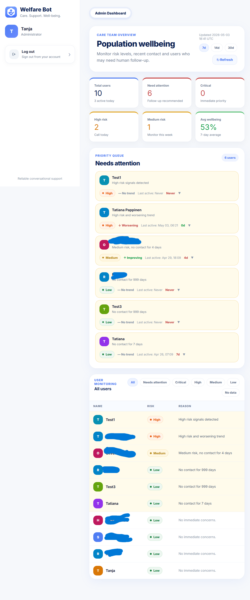

# Welfare Bot

**AI-powered full-stack system for proactive elderly wellbeing monitoring**

Welfare Bot is a production-style full-stack application that combines conversational AI, backend data pipelines, and machine learning to detect early signs of decline in elderly users living independently.

The system is designed as a scalable architecture — not just a chatbot — with clear separation between API, services, ML layer, and frontend.

## Live Demo

**https://welfarebot-production.up.railway.app**

---

## Screenshots

### Registration


### Login


### Finnish conversation — daily check-in
The bot greets the user in Finnish and asks about their night.


### Risk detection in action
User mentions pain and poor sleep — bot detects signals and responds with concern.


### Wellbeing trends
7-day trend chart with daily scores and soft insights.


### Admin dashboard
Population-level care overview with priority queue, risk badges, and trend tracking.


### API documentation
Full REST API with 40+ endpoints.


### Test suite — 148 passing


---

## Architecture

```
Frontend (React + TypeScript)
        ↓
API Layer (FastAPI)
        ↓
Service Layer (Business Logic)
        ↓
Data Layer (PostgreSQL)
        ↓
ML Layer (scikit-learn + OpenAI)
        ↓
Notification Layer (SendGrid)
```

### Key architectural decisions
- Layered backend architecture (API → services → DB)
- Stateless API with JWT authentication + rate limiting
- Background processing via APScheduler (3 scheduled jobs)
- Separate ML pipeline — non-blocking API requests
- Frontend fully decoupled via REST API
- Email notification pipeline via SendGrid

---

## Core Components

### Backend (FastAPI)

REST API with modular endpoints: auth, conversations, wellbeing, anomaly detection, admin dashboard, ML insights, alert feedback, notifications, voice

- SQLAlchemy ORM with PostgreSQL
- JWT authentication with rate limiting (slowapi)
- Password reset via email token

### Service Layer

Encapsulated business logic:

- `risk_service` — hybrid rule + LLM risk detection
- `aggregation_pipeline` — daily wellbeing scoring
- `anomaly_detector` — statistical Z-score detection
- `ml_anomaly_model` — IsolationForest per-user model
- `wellbeing_predictor` — linear regression next-day prediction
- `conversation_quality` — LLM-based session quality scoring
- `data_quality` — validation & monitoring
- `notification_service` — SendGrid email alerts
- `weekly_report` — Monday population summary email
- `scheduler` — 3 background jobs (aggregation, notifications, weekly report)

### Data Layer

Main entities: users, conversation_messages, daily_checkins, risk_analyses, wellbeing_daily_metrics, care_contacts, notifications, password_reset_tokens

Supports time-series analytics and personalisation.

### ML Layer

- **IsolationForest** — per-user unsupervised anomaly detection
- **LinearRegression** — next-day wellbeing score prediction
- **LLM scoring** — conversation quality evaluation (GPT-4o-mini)
- Feature engineering (10 features per user)
- StandardScaler preprocessing
- Hyperparameter tuning (contamination parameter)
- Precision/recall tracking via care worker feedback loop

### Frontend (React + TypeScript)

SPA built with Vite, component-based architecture, API-driven state.

Components: Chat interface, Wellbeing analytics, Auth system (login + register + password reset), Admin dashboard, Care contact form, Wellbeing score card, Trend chart

---

## Key Features

### Conversational AI
- Daily wellbeing check-ins in Finnish, English, Swedish
- Personalised by user first name
- Topic tracking — no repeated questions per session
- Hybrid risk detection (rule-based + GPT-4o-mini)

### ML & Data Pipeline
- IsolationForest anomaly detection per user
- Linear regression wellbeing prediction (next day)
- LLM-based conversation quality scoring
- Daily aggregation pipeline (runs 00:05 UTC)
- Data quality monitoring with outlier repair

### ML Accuracy Monitoring
- Care worker feedback loop — thumbs up/down on alerts
- Precision/recall/F1 calculated from real feedback
- Alert threshold tuning recommendations
- `GET /api/v1/admin/feedback/accuracy` endpoint

### Notification Pipeline
- HIGH/CRITICAL risk → email alert to care contact (SendGrid)
- Password reset → secure email with expiring token
- Weekly population report → Monday 08:00 UTC to admin
- Notifications processed every 5 minutes via scheduler

### Admin Dashboard
- Population wellbeing overview
- Priority queue — only genuinely concerning alerts
- Smart alert thresholds (no false alarms for inactive users)
- Alert reason shown per user
- Filter by risk level
- Period selector (7d / 14d / 30d)

### Security
- JWT authentication
- Rate limiting: 5/min on login, 3/min on password reset
- Password reset via time-limited email token
- Admin accounts filtered from population view

---

## Tech Stack

**Backend:** FastAPI, PostgreSQL, SQLAlchemy, Alembic, APScheduler, slowapi

**AI / ML:** OpenAI (GPT-4o-mini, Whisper, TTS-1), scikit-learn (IsolationForest, LinearRegression)

**Notifications:** SendGrid (transactional email)

**Frontend:** React, TypeScript, Vite

**DevOps:** Docker, Railway

---

## Testing

**148 automated tests** covering:
- ML models (IsolationForest, LinearRegression, anomaly detection)
- Data pipelines (aggregation, quality checks)
- API endpoints
- Scheduler jobs
- Alert feedback and accuracy metrics
- Wellbeing prediction logic

```bash
pytest app/tests/
```

---

## Ethics

This system handles sensitive health data about vulnerable users. See [ETHICS.md](ETHICS.md) for full documentation including:
- Data minimisation principles
- Third-party processors (OpenAI, SendGrid, Railway)
- Human oversight requirements
- Notification pipeline ethics
- GDPR considerations

---

## What this project demonstrates

- Full-stack system design with production-style architecture
- Real ML integration with accuracy monitoring and feedback loop
- Proactive vs reactive alerting (prediction before decline)
- Ethical AI design for vulnerable populations
- Data pipeline thinking (collection → quality → aggregation → ML → notification)
- Scalable application structure with 40+ REST endpoints